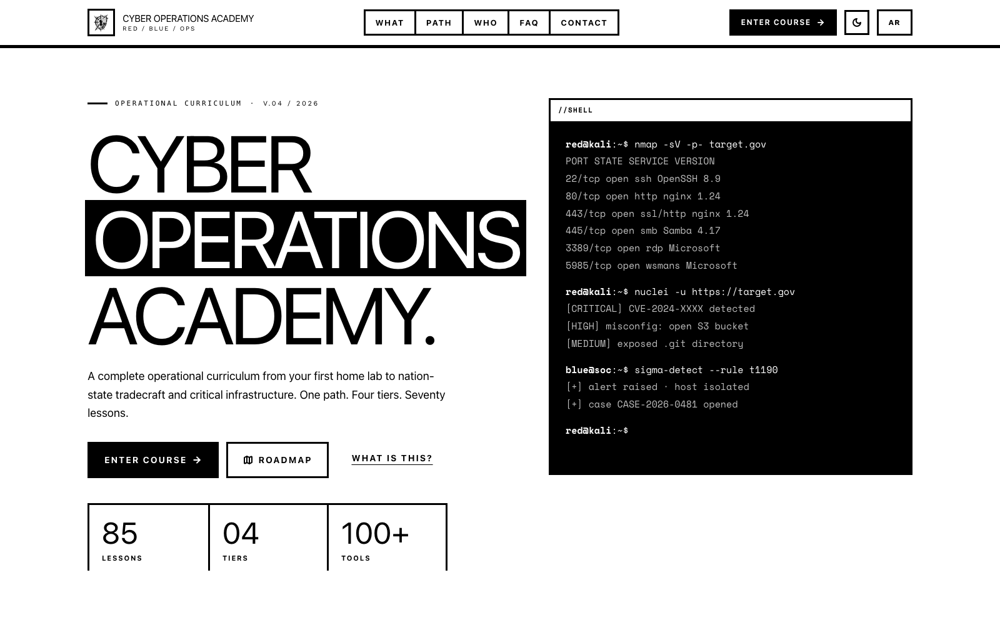
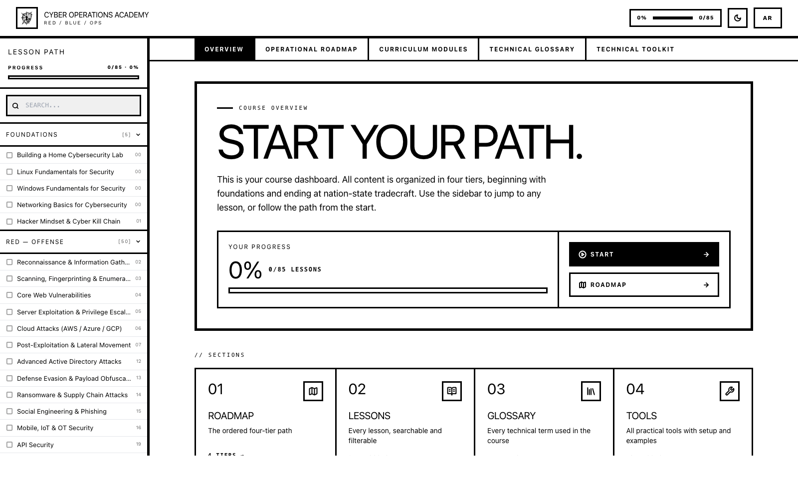
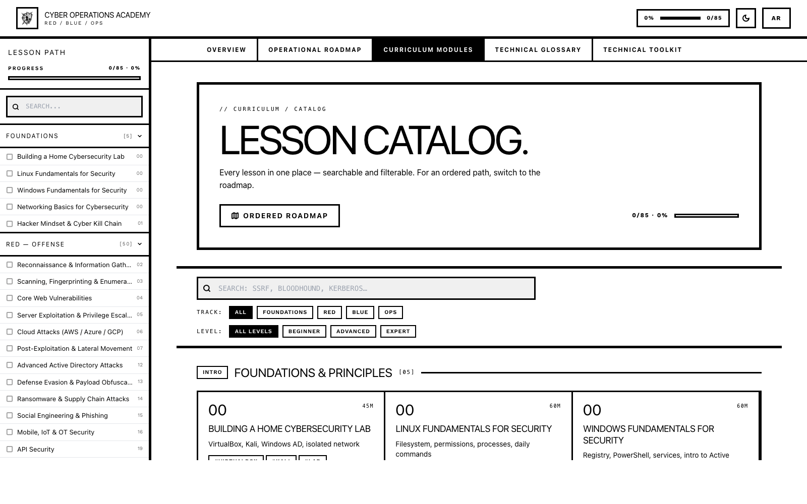
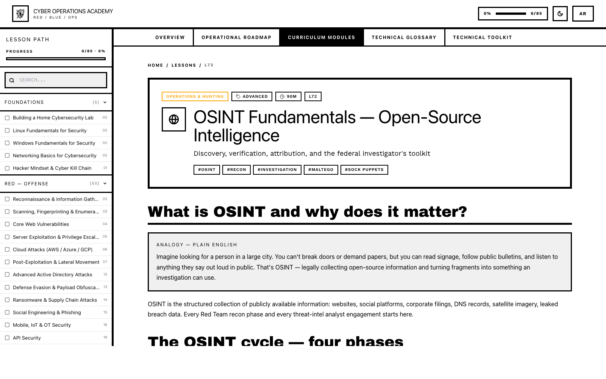
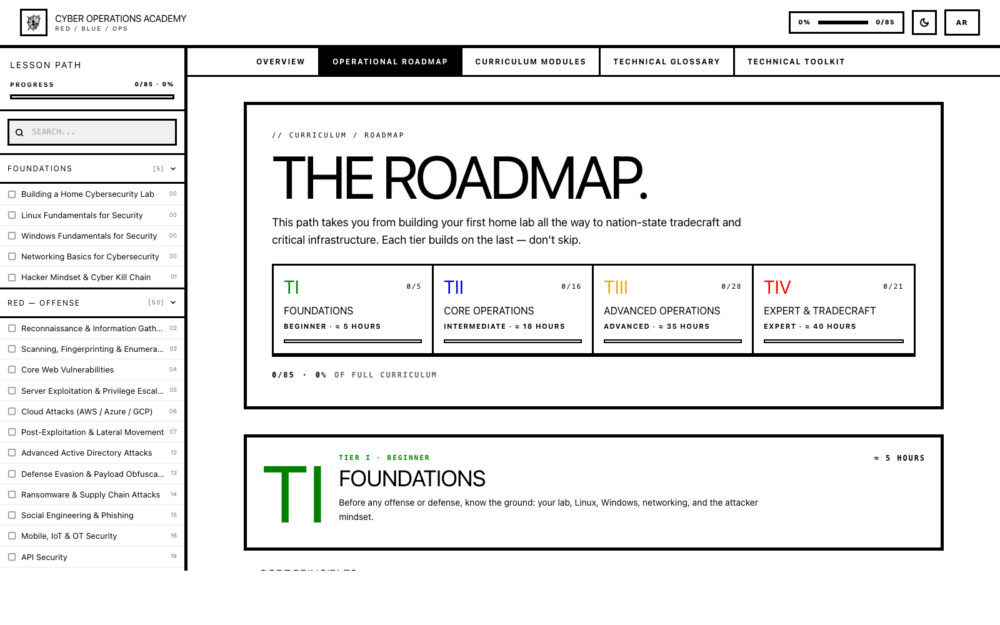
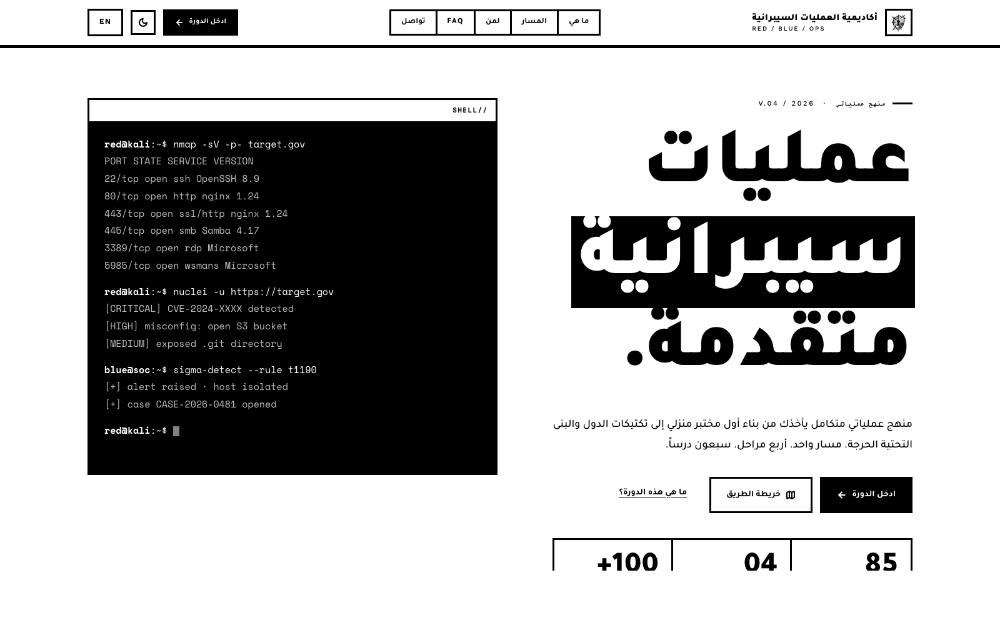

# Cyber Operations Academy

> **Live:** https://cyber.kareem-3del.com  
> A bilingual (Arabic / English) cybersecurity course — federal-grade Red / Blue / Ops curriculum, 85+ lessons across 4 tiers, built with a **RawBlock brutalist** design system.



---

## What is this

A complete operational curriculum that takes you from your first home lab to nation-state tradecraft and critical infrastructure. **One path. Four tiers. Eighty-five lessons.**

Every lesson pairs offense with defense — if you can run the technique, you can detect and stop it. Built for legally-authorized teams: federal Red / Blue / SOC / IR, vulnerability researchers, and professional pentesters.

| | |
|---|---|
| **Live URL** | https://cyber.kareem-3del.com |
| **Stack** | Next.js 14 (App Router) · TypeScript · Tailwind · Lucide |
| **Languages** | Arabic (RTL) + English (LTR), every lesson |
| **Lessons** | 85 across 4 tracks (Intro, Red, Blue, Ops) |
| **Tools catalog** | 100+ practical Red / Blue tools |
| **Glossary** | Searchable AR/EN technical reference |
| **Hosting** | Self-hosted: Docker + Traefik + Let's Encrypt |
| **CI/CD** | GitHub Actions auto-deploys on every push to `main` |

---

## Screenshots

### Landing page (English)


### Course dashboard
The `/course` overview: progress, sections, per-track stats, "up next" queue.


### Lessons catalog
85 lessons, searchable & filterable by track / level.


### Lesson detail (OSINT Fundamentals)
Brutalist `LessonShell` — every lesson follows the same shape: analogy → mechanics → walkthrough → defense → references.


### Roadmap
The four-tier learning path, with progress per tier.


### Arabic (RTL) view
First-class RTL: `<html lang="ar" dir="rtl">`, mirrored chevrons, per-language wordlists.


---

## Curriculum

### Four tiers

| Tier | Focus | Lessons | Target hours |
|---|---|---|---|
| **I — Foundations** | Lab, Linux, Windows, networking, mindset | 5 | ≈ 5h |
| **II — Core Operations** | Recon, scanning, baseline defense, tooling, law | ~16 | ≈ 18h |
| **III — Advanced Operations** | Web, AD, cloud, IoT, blue-team detection & DFIR | ~30 | ≈ 35h |
| **IV — Expert / Tradecraft** | Vuln research, exploit dev, nation-state, ICS, full chains | ~22 | ≈ 40h |

### Highlight lessons (recently added)

- **OSINT Fundamentals** — investigator's toolkit, attribution signals
- **Linux / Windows Privilege Escalation** — sudo, SUID, capabilities, Potato family
- **Lateral Movement** — Pass-the-Hash, PsExec, WMI, BloodHound paths to DCSync
- **Password Cracking** — Hashcat / John, rules, masks, Kerberoasting workflow
- **Memory Forensics** — Volatility 3, malfind, hollowfind, rootkit triage
- **SIEM & Detection Engineering** — Sigma + KQL + Splunk SPL, ATT&CK coverage measurement
- **MFA / SAML / OAuth Attacks** — AiTM with Evilginx, consent phishing, Golden SAML
- **ICS / SCADA Protocols** — Modbus / DNP3 / IEC-104, the Purdue model, Stuxnet-class anatomy
- **Pentest Reporting** — federal-grade documentation, CVSS 3.1, attack-path narratives

---

## Architecture

```
app/
├── layout.tsx              ← root <html> + providers only
├── page.tsx                ← /  (locale redirect)
└── [locale]/               ← /ar, /en
    ├── layout.tsx          ← I18n + Progress providers
    ├── page.tsx            ← LANDING — wrapped in <PublicShell>
    └── course/             ← course area  (under <CourseShell>)
        ├── layout.tsx      ← header + sidebar + course-tabs
        ├── page.tsx        ← course dashboard
        ├── roadmap/page.tsx
        ├── lessons/<slug>/page.tsx   × 85
        ├── glossary/page.tsx
        └── tools/[slug]/page.tsx

components/
├── SiteChrome.tsx          ← PublicShell + CourseShell
├── CourseTabs.tsx          ← sticky sub-nav under header
├── Sidebar.tsx             ← lessons-by-track navigator
├── LessonShell.tsx         ← Section / Callout / Code / Terminal / Step / Card / Analogy
├── ThemeToggle.tsx         ← light / dark
├── L.tsx                   ← locale-aware <Link> wrapper
└── LanguageToggle.tsx

lib/
├── i18n.tsx                ← <T>, <L>, useI18n()
├── progress.tsx            ← localStorage tracker
├── lessons.ts              ← LESSONS metadata (single source of truth)
├── glossary.ts             ← GLOSSARY terms
└── tools.ts                ← TOOLS catalog
```

### Two layouts, one site

- **`PublicShell`** — landing page only, no sidebar, anchor nav (What / Path / Who / FAQ)
- **`CourseShell`** — every `/course/*` page, with the brutalist Sidebar + CourseTabs

### Bilingual content rules (non-negotiable)

```tsx
// short inline string
<T ar="نص" en="text" />

// JSX block
<L ar={<>...</>} en={<>...</>} />

// shared component title
<Section title="..." titleEn="..." />
```

Locale-aware links: **never** `next/link` directly — always:

```tsx
import { Link } from "@/components/L";
<Link href="/course/lessons/recon" />   // becomes /ar/course/... or /en/course/...
```

---

## Design system: RawBlock

White surfaces, black borders, no shadows, no rounded corners. **Blue (`#0000FF`) is reserved for hyperlinks only.**

| | |
|---|---|
| **Display font** | Archivo Black (40–128px) |
| **Body font** | Work Sans 400/500/600/700 |
| **Mono font** | Space Mono |
| **Borders** | 3px (default), 5px (heavy), 1px (thin); radius **0** everywhere except radio dots |
| **Hover** | full color inversion (black ↔ white) |
| **States** | success #008000, warning #FFA500, error #FF0000, info / link #0000FF |

Full spec lives in [`design.md`](design.md).

---

## Local development

```bash
npm install
npm run dev       # http://localhost:3000  (redirects to /ar)
npm run build     # production build — must pass cleanly
npm run start     # run the build locally
```

Notes:
- After moving / renaming files, wipe `.next/` if `next dev` shows MODULE_NOT_FOUND.
- Run `npm run build` after non-trivial changes — it catches missing locale routes and stale chunks `next dev` can hide.

---

## Adding a new lesson

1. Append metadata to `LESSONS` in `lib/lessons.ts` (slug, number, AR+EN title/subtitle, track, level, duration, icon, tags).
2. Create `app/[locale]/course/lessons/<slug>/page.tsx` using the `LessonShell` skeleton:

```tsx
"use client";
import { LessonShell, Section, Callout, Code, Terminal, Step, Analogy, TwoCol, Card, L } from "@/components/LessonShell";

export default function Page() {
  return (
    <LessonShell slug="<slug>">
      <L
        ar={<>
          <Section title="...">
            <Analogy>...</Analogy>
            <Callout kind="danger" title="...">...</Callout>
            ...
          </Section>
        </>}
        en={<>...</>}
      />
    </LessonShell>
  );
}
```

3. Pair every offensive technique with a `Callout kind="good"` defense block — non-negotiable per project rules.

---

## Deployment

### Production stack on the box

- **Traefik** reverse proxy (Docker, on `traefik-public` network) → routes `Host(\`cyber.kareem-3del.com\`)` to the app container, handles Let's Encrypt automatically
- **Docker Compose** brings up a single `cyber-course` service exposing port 3000 internally
- **Multi-stage `Dockerfile`** (Node 20 alpine → Next.js standalone output)

```yaml
# docker-compose.yml — relevant labels
labels:
  - "traefik.enable=true"
  - "traefik.http.routers.cyber.rule=Host(`cyber.kareem-3del.com`)"
  - "traefik.http.routers.cyber.entrypoints=websecure"
  - "traefik.http.routers.cyber.tls.certresolver=letsencrypt"
  - "traefik.http.services.cyber.loadbalancer.server.port=3000"
```

### CI/CD — auto-deploy on push

`.github/workflows/deploy.yml` triggers on every push to `main`:

1. Configure SSH from GitHub secrets (`SSH_PRIVATE_KEY`, `SSH_KNOWN_HOSTS`, `SSH_HOST`, `SSH_PORT`, `SSH_USER`)
2. SSH into the server  →  `git fetch && git reset --hard origin/main`
3. `docker compose build --pull && docker compose up -d --force-recreate`
4. `docker image prune -f`
5. Smoke-test the public URL (200 / 301 / 302 / 307 / 308)

A `concurrency: deploy-prod` group prevents two deploys racing.

### Server-side bootstrap (one-time)

```bash
# On the server
mkdir -p /opt && cd /opt
git clone https://github.com/Kareem-3del/cyber-course.git
cd cyber-course
docker compose up -d --build
```

The Traefik instance running on the host (already configured with the `letsencrypt` resolver) picks up the new container via Docker labels and provisions a TLS cert automatically.

---

## License & legal

Educational material for **professionals and parties legally authorized** to perform penetration testing and cyber-defense work. Every offensive technique is intended for execution in an isolated lab or against systems you have **written authorization** to test. Every lesson includes a `Callout kind="danger"` legal warning.

Any use outside that scope is the user's responsibility.

---

## Repository

- **Source:** https://github.com/Kareem-3del/cyber-course
- **Live:** https://cyber.kareem-3del.com
- **Issues / contributions:** open an issue on GitHub

Built with no analytics, no tracking, no signup — open access.
